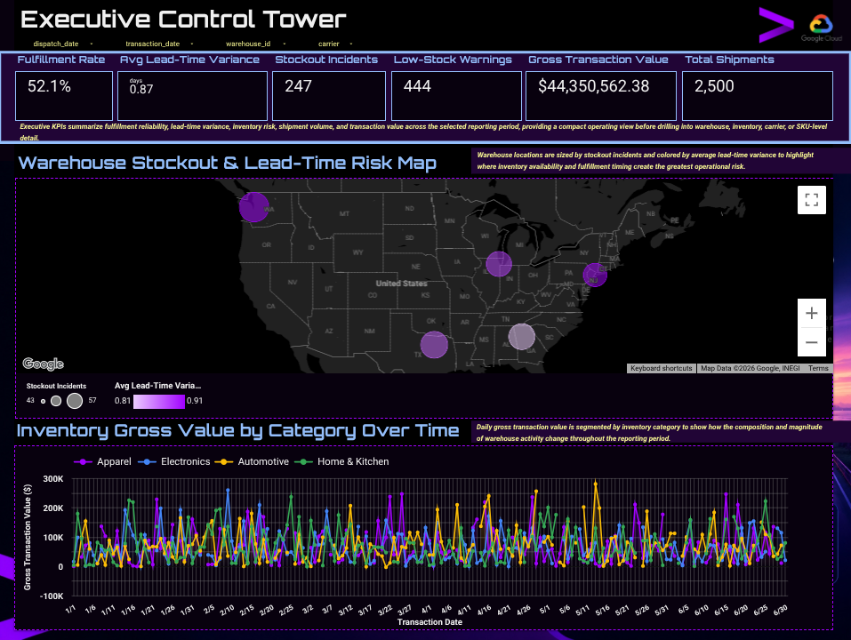
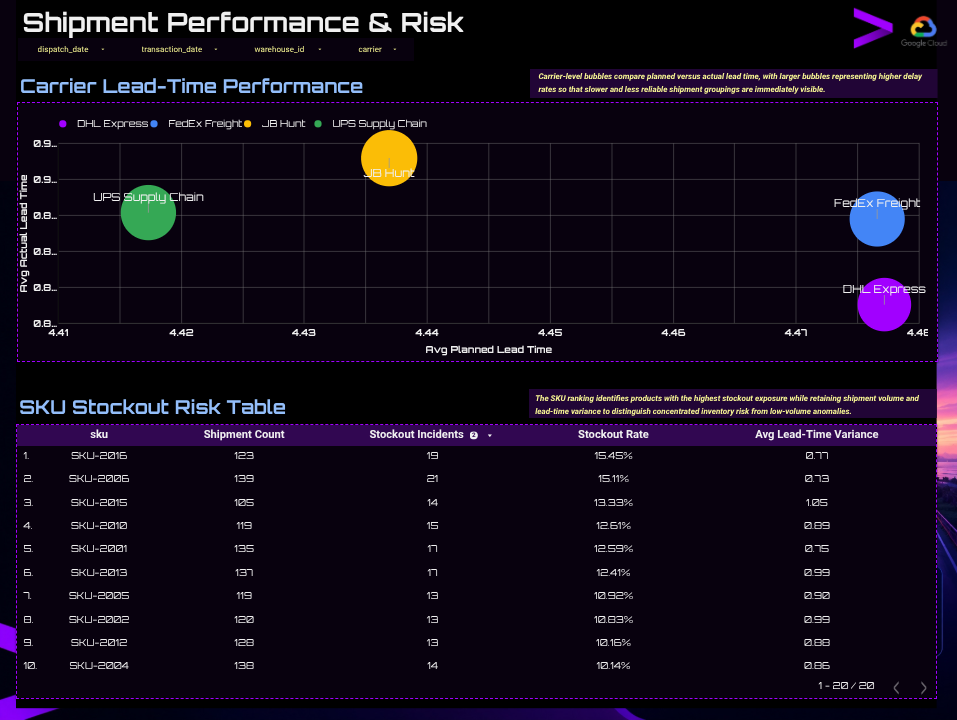

# Enterprise Supply Chain Optimization on Google Cloud
---

**Google Cloud Specialiast:** Daniel Rodriguez III

**Date:** September 30, 2026

**Project:** self-directed portfolio project 

**Dataset:** `driiiportfolio.supply_chain_optimization` 

**Validation:** 2026-09-30

---

**Self-directed portfolio project:** BigQuery warehouse, data quality/governance, statistical diagnostics, BigQuery ML, performance testing and a Looker Studio Control Tower using synthetic supply-chain data.

> **Synthetic / independent project. No real client or employer data.**

## Final state — 2026-09-30

| Area | State |
|---|---|
| Python synthetic generation | ✅ 5 warehouses / 1,500 transactions / 2,500 shipments |
| BigQuery raw + staging | ✅ represented by supplied validation record |
| Dashboard semantic layer | ✅ `vw_shipment_detail` + `vw_inventory_daily` |
| Data quality | ✅ 15/15 PASS in supplied validation record |
| Statistics | ✅ ANOVA / Chi-Square / OLS |
| BigQuery ML | ✅ ROC AUC 0.527; not promoted |
| Looker Studio | ✅ final dashboard specification/reference synchronized to completed dashboard corrections; live report is external |
| Billing-gated GCP services | 🟡 documented as design paths, not claimed as executed |

## Verified headline results

**2,500 shipments · 1,500 inventory transactions · 1,303 on-time/early · 1,197 delayed · 247 stockouts · 444 low-stock · 52.1% fulfillment · +0.87 days average variance · $44,350,562.38 gross value.**

ANOVA F=0.174 p=0.952; Chi-Square=3.342 df=8 p=0.911; OLS R²=0.002 F-test p=0.799; BigQuery ML ROC AUC=0.527 vs 0.521 majority baseline.

The synthetic generator intentionally does not encode warehouse/carrier/SKU causal structure, so null findings are expected. The project demonstrates validation discipline rather than manufactured operational effects.

## Repository

```text
├── README.md
├── requirements.txt
├── notebooks/supply_chain_optimization_pipeline.ipynb
├── scripts/
│   ├── synthetic_data_pipeline.py
│   ├── bigquery_transformations.sql
│   ├── data_quality_checks.sql
│   ├── ml_delay_classifier.sql
│   └── statistical_analysis.py
└── docs/
    ├── Executive_Summary.md
    ├── Dashboard_Executive_Summary.md
    ├── Looker_Studio_Build_Guide.md
    ├── JD_Mapping.md
    ├── Validation_Log.md
    ├── Repository_QA.md
    ├── Project_Disclaimer.md
    ├── REPOSITORY_MANIFEST.json
    └── reference_dashboard/control_tower_reference.html
```

## Run order

1. Open the notebook in Colab.
2. Authenticate to `driiiportfolio`.
3. Run top-to-bottom.
4. Confirm 15/15 DQ PASS and 2,500/1,500 dashboard-source reconciliation.
5. Build/maintain the Looker Studio report from the two current semantic views.
6. Use the fixed Jan 1–Jun 30, 2026 range and final dashboard configuration in `docs/Looker_Studio_Build_Guide.md`.
7. Compare the live report to the acceptance values before publication.

## Final dashboard configuration

The repository reflects the completed five dashboard corrections:

1. Sixth scorecard = **Total Shipments**, metric `COUNT(log_id)`, value 2,500.
2. Avg Lead-Time Variance displayed as **+0.87 days**.
3. SKU risk table sorted **Stockout Rate descending**, then **Stockout Incidents descending**.
4. Technical field names replaced with executive-facing labels in the presentation layer.
5. Inventory trend Y-axis minimum set to **0**.

## Dashboard Snapshots

**Page 1.** 

**Page 2.** 


## Free-tier boundary

BigQuery Sandbox supports no-billing experimentation but has 60-day expiration for tables/views/partitions and does not support streaming or DML. The project therefore uses batch load jobs and `CREATE OR REPLACE`/CTAS patterns. Cloud Storage, Pub/Sub, Dataflow, Dataproc, Dataplex and Vertex AI are documented production paths but are not claimed as executed in the no-billing environment.
